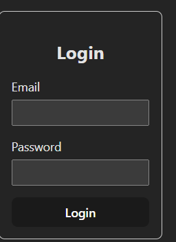
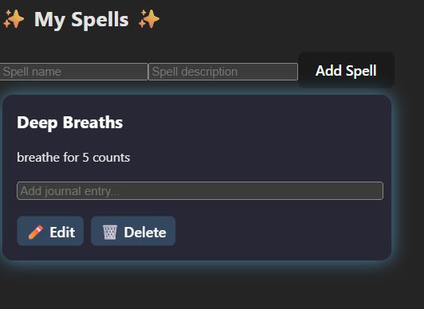
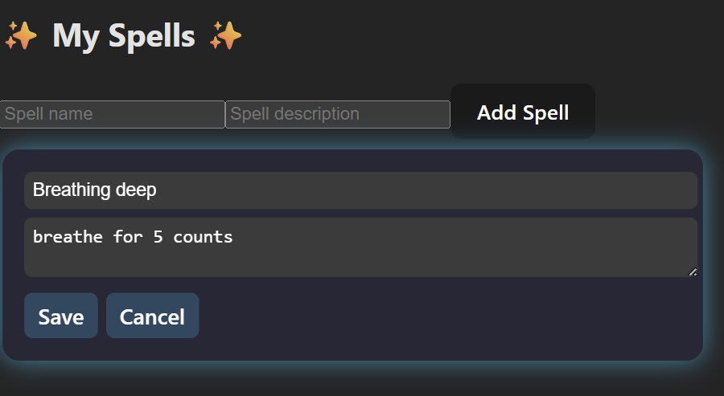

# Spellweaver

**Spellweaver** is a therapy platform with gamified coping skills that allows patients to manage spells (coping exercises) and track spellcasts (practice logs). Therapists can view patient activity and provide support. The platform is built with a **MERN stack** (MongoDB, Express, React, Node.js) and includes JWT-based authentication.

---

## Table of Contents

- [Features](#features)
- [Screenshots](#screenshots)
- [Getting Started](#getting-started)
- [Architecture](#architecture)
- [API Endpoints](#api-endpoints)
- [Future Enhancements](#future-enhancements)
- [License](#license)

---

## Features

- **User Authentication**: Signup/Login for patients and therapists using JWT tokens.
- **Spell Management**:
  - Add, edit, and delete spells.
  - Cast spells with optional journal entries.
- **Spellcasts**: Track spell usage with timestamps and context.
- **Patient-Therapist Connection**: Therapists can monitor patient spellcasts.
- **React Frontend**: Interactive pages for login and spells management.
- **RESTful API**: Built with Express and MongoDB.

---

## Screenshots/Demos

### Login Page


### Spells Page



### Spell Card Demo

Click the image below to watch the demo:

[](./spellweaver-client/public/screenshots/spell-card.mp4)

---

## Getting Started

### Prerequisites
- Node.js v20+
- npm or yarn
- MongoDB Atlas free cluster

### Installation

#### Clone the repository:

```bash
git clone https://github.com/yourusername/spellweaver.git
cd spellweaver
```

#### Server
```bash
cd spellweaver-server
npm install
```

#### Create a .env file with:
```bash
PORT=4000
MONGODB_URI=<Your MongoDB Atlas URI>
JWT_SECRET=<Your JWT Secret>
```
#### Start the server:
```bash
npm run dev
```
#### Client
```bas
cd spellweaver-client
npm install
npm start
```

##### Open your browser at http://localhost:3000.

#### Architecture
```bash
spellweaver/
│
├─ spellweaver-server/      # Backend
│  ├─ controllers/          # API logic
│  ├─ models/               # Mongoose schemas
│  ├─ routes/               # Express routes
│  └─ app.js                # Express app
│
├─ spellweaver-client/      # Frontend
│  ├─ src/
│  │  ├─ components/       # React components (SpellCard, etc.)
│  │  ├─ pages/            # Login, SpellsPage
│  │  └─ App.jsx
│  └─ public/
│     └─ screenshots/       # Placeholder screenshots
```

Backend: Node.js + Express + MongoDB + Mongoose

Frontend: React with functional components and hooks

Authentication: JWT-based with middleware

Spellcasts: MongoDB documents storing spellId, castBy, journal, timestamp, context, visibleTo

#### API Endpoints

GET /health → Server health check

POST /auth/signup → Signup (patient or therapist)

POST /auth/login → Login, returns access token

GET /spells → List all user spells

POST /spells → Add new spell

PATCH /spells/:id → Edit spell

DELETE /spells/:id → Delete spell

POST /spells/:id/cast → Cast a spell with optional context and journal entry

POST /conversations/ensure → Create or get conversation between patient and therapist

POST /conversations/:id/messages → Post a message

GET /conversations/:id/messages → Get all messages


#### Future Enhancements

 - Add gamification elements (points, badges, streaks)

 - Real-time notifications via WebSockets

 - Therapist dashboard with analytics

 - Mobile-friendly design

#### GitHub Actions workflow for CI/CD

#### License

This project is licensed under the ISC License.


---

#### This README includes:

- Project overview
- Screenshots (placeholder paths)
- Setup instructions for server and client
- Architecture diagram (text-based)
- API endpoints
- Future enhancements
- License section  

---